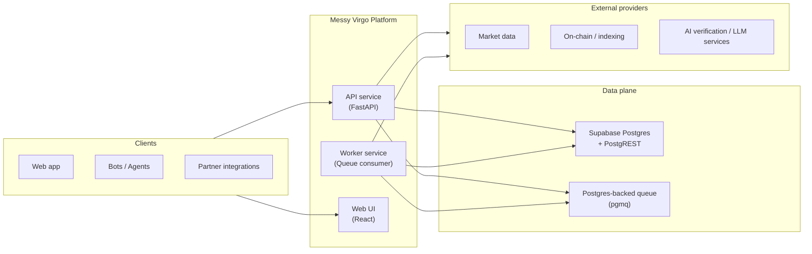
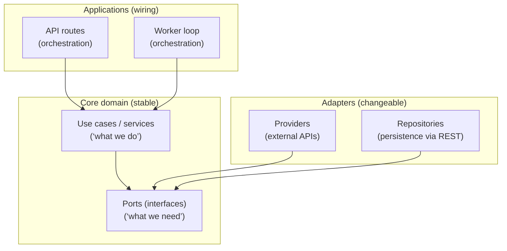
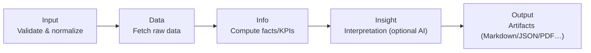

Messy Virgo is a platform for building a suite of tools that help crypto teams move from “gut feel” to **structured, testable decisions**—with humans in the loop. One major part of that suite is our **Due Diligence Engine**, which is built from focused, composable analysis modules we call **Lenses**.

Today, the **[Technical Analysis Lens](/crypto-token-technical-analysis.html)** is in an alpha release available for the community for free and already delivering value. Right now, we're building the **Macro Economics Lens** (global macro signals that don't depend on a token contract) and planning additional lenses that will complete our Due Diligence Engine which is due in Q1/26.

This post is a level‑200 overview of key building blocks, patterns, core tech, testing, and deployment.

> **Note:** Consider this a snapshot of the architecture direction, not a frozen spec. We’re building a startup, so some names and shapes may evolve, while the underlying principles stay consistent.

---

## How the pieces fit (high level)

We’re building multiple tools that connect into a single research and operations loop:

- **Market Data Hub**: robust pipelines for on‑chain and off‑chain data (prices, volume, liquidity, addresses, narratives) that continuously feed Messy’s internal view of the market.
- **Due Diligence Engine**: structured analysis and scoring powered by modular Lenses (Technical Analysis, Macro Economics, and more).
- **Token & Project Scanner**: tools that turn contract checks, repo activity and tokenomics into structured scores instead of gut feeling.
- **Signal & Scenario Dashboards**: interfaces that show which assets or narratives Messy would currently prioritize, and how those choices perform in backtests versus simple ETH/BTC holds.

This post focuses on the **Due Diligence Engine architecture**, and specifically how Lenses let us ship analysis capabilities as modular “mini‑products” that can be composed over time.

---

## The “Lens” idea: modular analysis inside the Due Diligence Engine

A **Lens** is a **bounded analysis pipeline** with a stable contract. It can be shipped independently (like a standalone feature), but it’s designed to plug into the Due Diligence Engine:

- **Shared execution engine**: consistent orchestration, persistence, caching, and observability across lenses.
- **Pluggable providers**: integrate external data sources without rewriting core logic.
- **Progressive results**: “partial but useful” output beats “all or nothing”.

The result: we can add lenses quickly without turning the platform into a monolith.

---

## Runtime architecture

At runtime, Messy Virgo is a small set of services plus a managed data plane:

**What to notice:**

- The **API service** is the public entry point for running analyses, retrieving results, and generating artifacts.
- The **worker** handles long‑running or queued work, scaling with demand.
- **Managed Postgres (Supabase)** stores persisted analysis results and supports safe, atomic operations.
- A **Postgres‑backed queue** (via `pgmq`) allows reliable async processing without introducing a separate message broker at this stage.

---

## Core technologies (selected)

We keep the stack modern and pragmatic:

- **Backend**: Python (3.12+) with **FastAPI** for an API‑first, agent‑friendly interface.
- **Frontend**: **React + TypeScript** (Vite/Tailwind) for fast iteration and clean report UX.
- **Data plane**: **Postgres** (managed via Supabase) with a REST interface layer (PostgREST) for safe, consistent data access patterns.
- **Async processing**: a Postgres‑backed queue (`pgmq`) for reliable background work and straightforward operations.
- **Observability**: structured logs, metrics, and tracing (designed to be cloud‑native).
- **Infra & deployment**: containerized services on a managed container platform (Azure Container Apps), deployed via infrastructure‑as‑code.

---

## Core architectural pattern: Hexagonal (Ports & Adapters)

We organize the codebase around **hexagonal architecture** (a.k.a. ports & adapters). The goal is simple: keep business logic stable while everything around it evolves (providers, storage, frameworks, cloud).

**How this helps us move fast without breaking things:**

- **Lenses are use cases**: the “why” and “rules” live in the core, independent of frameworks.
- **Providers and repositories are replaceable**: we can swap a data source, adjust caching, or add a new backend capability without rewriting lens logic.
- **Routes stay thin**: API endpoints coordinate inputs/outputs; they’re not where the business logic lives.

This matters for a “lens platform” because we expect constant change at the edges: new providers, new chains, new KPIs, new export formats, and new product surfaces.

---

## The Lens pipeline: Input → Data → Info → Insight → Output

Every Lens follows the same high‑level pipeline contract:

**What each stage means (in plain terms):**

- **Input**: normalize identifiers and context (e.g., token identity, timestamps, lens parameters).
- **Data**: fetch and cache raw data from external sources; tolerate partial failures.
- **Info**: compute deterministic facts and metrics (KPIs, derived values, summaries).
- **Insight**: optional narrative or higher‑level interpretation (sometimes AI‑assisted, always provenance‑aware).
- **Output**: generate consumable artifacts for humans (reports) and machines (structured JSON).

This pipeline gives us two big wins:

1. **Repeatability**: deterministic computation lives in the Info stage, separate from flaky upstream calls.
2. **Extensibility**: new lenses reuse the same scaffolding (persistence, caching, exports, async jobs).

---

## Today: Technical Analysis Lens (working end‑to‑end)

The [Technical Analysis Lens](/crypto-token-technical-analysis.html) is our first complete "vertical slice". It demonstrates the platform's core capabilities:

- **Token identity resolution** and enrichment (best‑effort, multi‑source).
- **Multi‑provider data synthesis** for TA‑relevant signals.
- **Persisted analysis processes** so results are shareable/retrievable and exports can be generated consistently.
- **Graceful degradation**: if a provider is down or rate limited, the lens still returns the best possible report, with transparency about what’s missing.

Most importantly, it validates the core product strategy and allows us to **ship lenses to our broad community for real-life validation**, then compose lenses into a broader Due Diligence Engine.

---

## Next: Macro Economics Lens (13 KPI “market regime” context)

The Macro Economics Lens is intentionally different from token‑specific lenses. It produces **global macro indicators** that apply to market regime context (e.g., risk‑on / risk‑off signals), based on a compact set of **13 KPIs**.

Those KPIs are sourced from a number of well‑known macro data interfaces, most notably the **Federal Reserve Economic Data (FRED)** by the Federal Reserve Bank of St. Louis ([FRED homepage](https://fred.stlouisfed.org/)) and the **Bank for International Settlements (BIS)** ([BIS homepage](https://www.bis.org/)), then normalized into a consistent, provenance‑aware shape that the rest of the platform can consume.

Architecturally, it’s a strong proof that the same lens pipeline works beyond token‑centric workflows: the Input stage can be minimal, while Data/Info do the heavy lifting.

---

## Data, persistence, and caching: build for speed and reuse

Our data strategy is pragmatic: store what we need to make results **reproducible and reusable**, and cache what we need to be **fast and resilient**.

- **Persisted lens processes**: each lens execution stores a structured record of stages and outputs. This makes analyses shareable, exportable, and auditable at a high level.
- **Provider caches (raw responses)**: we cache upstream provider fetch results to reduce cost, avoid rate limits, and improve latency. This is especially valuable for repeat analysis and for new lenses that reuse the same underlying data.
- **Response caching (normalized outputs)**: we also cache lens-ready, normalized responses (not just raw provider payloads) so repeated runs can skip recomputation when inputs and freshness constraints allow.
- **On-demand artifacts**: we can build outputs (reports/exports) on-demand—or regenerate them on-demand—using the persisted process state plus cached provider/response data.

We also lean on database‑side atomic operations (via safe API patterns) to avoid race conditions when multiple workers or requests touch the same logical “process”.

---

## Reliability by design: graceful degradation + progressive data

Crypto data is messy: providers go down, chains behave differently, and “perfect coverage” is a myth. So our system is built to **degrade gracefully**:

- Providers are treated as **optional contributors**, not single points of failure.
- Outputs communicate whether a metric is **Present / Estimated / Unavailable** (instead of pretending “0” is truth).
- Every lens can ship value even when parts of the ecosystem are noisy.

This “progressive data model” is key to agent‑friendly systems: agents can reason about confidence and completeness, not just raw values.

---

## Security posture (high level)

We intentionally keep the public surface area small and the sensitive details private. At a high level:

- **Secrets are managed** via a secure secret store in the cloud (no secrets baked into images).
- The **worker** is deployed without public ingress; only the API and web UI are exposed publicly.
- We follow **least‑privilege** access patterns between services, storage, and providers.
- The system includes **rate limiting and usage tracking** as first‑class platform concerns.

We avoid publishing implementation details that would meaningfully help an attacker (exact endpoints, internal toggles, schema internals, or operational runbooks). The goal is transparency about architecture—not a blueprint for exploitation.

---

## Testing philosophy: fast feedback, high‑signal coverage

We optimize tests around what breaks most often in platforms like this:

- **Unit tests for core logic**: KPI calculations, normalization, scoring decisions, and error mapping.
- **Provider parsing tests**: validate that provider responses (or fixtures) map correctly into our internal schemas.
- **API‑level tests**: validate core flows (execute, retrieve, export) without “testing the framework”.

The end result is a suite that catches regressions early while keeping iteration speed high—especially important when adding new lenses or providers.

---

## Deployment & operations: containerized, scalable, observable

Messy Virgo runs as containerized services with a clean separation of concerns:

- **API service**: public HTTP ingress, orchestrates synchronous requests and triggers async work.
- **Worker service**: consumes queue messages and executes lens jobs; scales based on demand.
- **Web UI**: a separate frontend deployment for humans; the platform remains API‑first.

Infrastructure is deployed declaratively (infrastructure‑as‑code), and services run on a managed container platform with:

- **autoscaling** (including queue‑depth driven scaling for the worker),
- centralized **logs/metrics/tracing**,
- environment‑specific configuration and secret injection.

---

## Roadmap context: from foundation → research → execution → governance

Our architecture is designed to support an incremental, risk‑controlled roadmap:

- **Phase 1 – Foundation (Live)**: launch the token, treasuries, and initial test funds; establish presence and process on‑chain.
- **Phase 2 – Research (Target: Q1 2026)**: turn playbooks into signals, dashboards, and due‑diligence tools; Messy learns from structured data and real market behavior.
- **Phase 3 – Execution (Target: Q3 2026+)**: route a controlled share of capital through on‑chain strategies powered by Messy’s models, with human oversight and clear safeguards.
- **Phase 4 – Governance (2027+)**: gradually hand more control over parameters and capital allocation to the community via on‑chain governance once the stack has proved itself.
  - Link: [Read the full roadmap in our Litepaper](/litepaper.html)

This post focuses on the “Research” layer of the stack (and the plumbing that makes it reliable).

---

## Why this architecture matters for AI‑assisted fund operations

AI‑assisted workflows need more than “an answer”—they need:

- **Repeatable pipelines** (so results are explainable),
- **provenance and confidence** (so agents can reason),
- **fast iteration** (new lenses roll out without platform refactors),
- **safe scaling** (async processing, caching, controlled degradation).

Messy Virgo is designed as the foundation for that. If you’re building agent‑native crypto workflows and want to collaborate or integrate, we’d love to talk.
