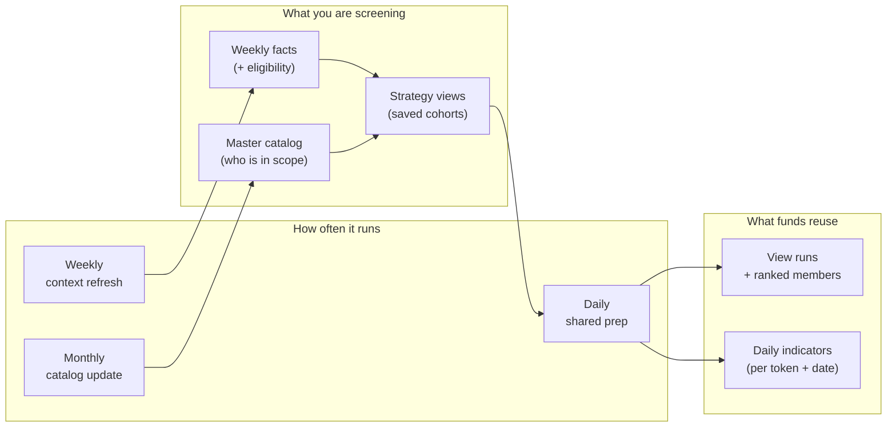

Fund-grade token screening sounds simple until you try to do it honestly at scale.

If you jump straight from “everything on the market” to “what should this fund look at today?,” you inherit noisy, expensive problems: the same research done over and over, snapshots that do not line up across funds, and no clear place to anchor a **published** fund story.

Messy’s screening approach is deliberately **not** one giant step. It breaks the work into stages: first **building and maintaining the catalog**, then **keeping lightweight weekly context fresh**, then **defining which slice of the market each strategy cares about**, and finally **preparing a shared daily layer of due diligence signals** before anyone runs a sleeve-specific screen.

This post is **part 1** of a short series. It covers the “upstream” half: how Messy prepares a fresh, screening-ready foundation before a sleeve—or an assistant—starts interpreting it.

> **Note:** This reflects where we are headed, not a frozen manual. Details may change; the idea of separating these stages should stay the same.

---

## How screening fits the bigger picture

Messy Virgo is building tools that help crypto teams move from gut feel to **structured, testable decisions**. A major pillar is the **Due Diligence Engine**: composable **Lenses** (for example Technical Analysis and Macro Economics) that produce structured evidence.

**Screening** sits next to that, but it is not the same thing. Screening is the **operating rhythm** that turns a managed view of the token market into **reusable, date-stamped due diligence signals** for defined groups of tokens—so funds can run repeatable shortlist workflows without paying the full “market-wide prep” cost on every click.

Think of screening as **getting the evidence table ready at market scale**, not as choosing what to buy.

---

## Why we split the work

If we tried to go from “all tokens we know about” to “this fund’s candidates” in one leap, we would quickly hit:

- **Repeated heavy work** every time someone screens
- **Snapshots that disagree** across sleeves and funds
- **Logic that is hard to compare** across products and workflows
- **No clean line** between “what we meant to do” (setup) and “what we actually did on a given day” (runs)
- **No durable record** that fund activities, APIs, or public fund pages can point to

So we separate the problem into clear pieces:

- **Catalog** — what belongs in Messy’s managed list at all
- **Weekly screening context** — light eligibility and market context, refreshed often
- **Strategy views** — deliberate slices of the market (not ad hoc spreadsheets)
- **Daily preparation** — the shared signal layer for each view and each calendar day
- **Sleeve-specific interpretation** (part 2)
- **What gets saved and shown on the fund side** (part 2)

That split makes screening **faster to run**, **easier to explain**, and **safer to automate**—because software and assistants work off defined steps and saved outputs, not off improvised one-offs.

---

## Ideas that matter (upstream half)

These matter more than any internal name:

- **Catalog first, sleeves second.** A sleeve does not screen “the whole internet.” It screens Messy’s prepared catalog and the views built on top of it.
- **One shared daily layer.** Daily due diligence signals are prepared **once per strategy view and date**, then reused when downstream screening runs.
- **Screening prepares evidence; it does not allocate.** Upstream steps do not pick fund candidates; they prepare inputs others can defend.
- **“As of which day?” is explicit.** The system cares which **indicator date** a run represents—sleeve runs add their own sense of time (more in part 2).
- **Partial beats pretend-complete.** Messy is built to stay useful when coverage is incomplete, and to make gaps visible instead of hiding them behind misleading zeros.

---

## The journey in four stages

### Stage 1: Monthly catalog — “what belongs in Messy at all?”

The first stage asks a broad question:

**Which tokens should live in Messy’s managed catalog?**

This is about **scope and discovery**, not final investment merit. On a monthly rhythm, Messy pulls in tokens from curated market sources, applies broad inclusion rules aligned with how funds actually operate, and keeps each token’s lifecycle (active vs inactive) tied to the latest monthly picture.

The goal is to stay honest about what is in bounds—not to pre-judge what is “good.”

### Stage 2: Weekly refresh — “what do we know this week?”

The second stage asks:

**For active catalog tokens, what lightweight screening context do we have this week?**

Each week, active tokens get screening-oriented fields refreshed—things like market context, liquidity and volume context, reserve context when available, risk signals when available, and **eligibility** with reasons when something is ruled out.

That weekly layer is the bridge between “this token exists in Messy” and “this token is in a screenable state under today’s rules.”

### Stage 3: Strategy views — “which slice of the market does this strategy care about?”

A **strategy view** is not a one-off pasted list. It is a **saved definition** of a cohort: a chain, filters, ordering, and a sensible cap—like a smart filter you can reuse.

Examples of what a view might express:

- large caps on a specific network
- DeFi on Ethereum with minimum liquidity
- “exclude certain categories and ineligible rows” style hygiene

Sleeves attach to these views so each strategy screens a **deliberate slice**, not the entire catalog.

### Stage 4: Daily batch preparation — “get today’s shared signal layer ready”

The fourth stage is where upstream screening becomes **date-stamped due diligence work**.

For each active view and each calendar day (in UTC), Messy:

1. figures out which tokens belong in the view right now
2. saves the current ranked membership for that view
3. runs a focused due diligence pass for those members
4. stores screening-ready indicator rows for that date

This stage still does **not** pick fund candidates. Its job is narrower: by the time a sleeve wants to screen, the **shared signal layer** for that sleeve’s view should already exist for the day—so downstream work can be quick, stable, and comparable across runs.

---

## How the pieces line up

**What to take away:**

- **Three rhythms on purpose:** monthly catalog alignment, weekly fact refresh, and daily preparation per view.
- The heavy “due diligence at cohort scale” work is **done once and reused**, not restarted on every ad hoc request.
- Strategy views are the **bridge** between catalog hygiene and the daily indicator layer.

---

## When data is messy (and it always is)

Crypto data will always be imperfect: feeds stall, chains diverge, and “100% coverage everywhere” is not realistic.

The upstream model is meant to stay useful anyway:

- weekly context can mark **ineligibility** with reasons (views respect those rules)
- daily preparation can proceed with **partial** indicator coverage; surfaces can show counts and coverage instead of treating missing data as a silent “zero”

That stance matches how we think about lens outputs: people and tools should see **completeness and confidence**, not only headline numbers.

---

## How we think about quality

We focus tests on what actually breaks in real workflows: **normalization and eligibility rules**, **how views resolve against the catalog**, and **what must be true before a daily run counts as complete**. The goal is fast feedback on the rules that define screening truth—not endless testing of plumbing for its own sake.

---

## Where this sits on the roadmap

This series sits in the **Research** layer of Messy’s roadmap: turning playbooks into **structured pipelines**, fund-visible outputs, and repeatable workflows—before any later phase would route capital automatically.

If you want the broader platform story (Lenses, services, published artifacts), start with our architecture overview on the blog, then come back here for screening.

---

## What comes next (part 2)

Upstream screening prepares the shared foundation. Downstream, Messy separates **sleeve setup** from **sleeve runs**, uses explicit **dates** so history stays readable, and connects saved runs to **fund activity** and **published fund surfaces**—with Messy Virgo acting as a disciplined operator on the same workflows people use.
