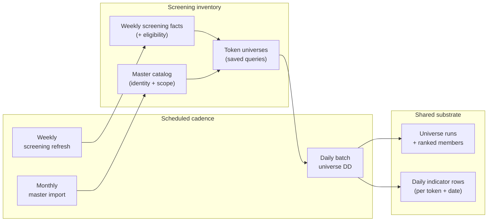
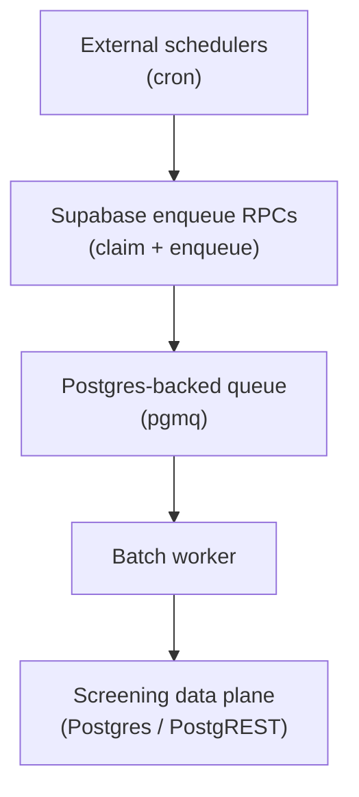

Fund-grade token screening sounds simple until you try to do it honestly at scale.

If you jump straight from “everything on CoinGecko” to “candidates for this sleeve today,” you inherit a pile of expensive, noisy problems: repeated provider work, inconsistent snapshots across funds, opaque agent behavior, and nowhere stable to hang a **published** fund narrative.

Messy’s screening pipeline is deliberately **not** one job and **not** one query. It is a staged system that separates **inventory formation**, **shared universe preparation**, and **daily due diligence materialization** from the later work of **sleeve-specific interpretation** and **persisted fund outcomes**.

This post is **part 1** of a short series. It focuses on the upstream half: how Messy builds a fresh, screening-ready substrate before any sleeve—or any AI assistant—starts interpreting it.

> **Note:** This is a snapshot of the screening direction, not a frozen spec. Names and tables may evolve; the separation of concerns should stay stable.

---

## How screening fits the bigger picture

Messy Virgo is building tools that help crypto teams move from gut feel to **structured, testable decisions**. A major pillar is the **Due Diligence Engine**: composable **Lenses** (Technical Analysis, Macro Economics, and more) that produce structured evidence.

Screening is adjacent but distinct. It is the **operating pipeline** that turns a managed view of the token market into **reusable, date-keyed due diligence indicators** for defined cohorts—**token universes**—so that fund sleeves can run repeatable shortlist workflows without recomputing the expensive upstream layer on demand.

Think of screening as **evidence preparation at market scale**, not portfolio construction.

---

## Why the model exists

If Messy tried to collapse “all known tokens” into “this sleeve’s candidates” in a single step, we would immediately get:

- **Duplicated upstream work** every time someone screens
- **Inconsistent market snapshots** across sleeves and funds
- **Hard-to-compare screening logic** across products and agents
- **No clean boundary** between “what we intend to do” (configuration) and “what we did on a given day” (execution)
- **No durable artifact** for fund activities, APIs, or public fund surfaces

The implemented model solves that by separating:

- **Inventory formation** (what belongs in Messy’s catalog at all)
- **Shared weekly screening facts** (lightweight eligibility and context)
- **Reusable universes** (deliberate cohorts, not ad hoc lists)
- **Daily DD materialization** (indicator substrate per universe and UTC date)
- **Sleeve-specific interpretation** (covered in part 2)
- **Fund-facing persistence and projection** (covered in part 2)

That separation makes screening **faster to operate**, **easier to reason about**, and **much easier to automate safely**—because agents orchestrate contracts; they do not become the database of record.

---

## Core design principles (upstream half)

These principles matter more than any single table name:

- **Inventory first, sleeves second.** A sleeve never screens the raw external token world directly. It screens the platform’s prepared inventory and its universes.
- **Shared daily substrate.** Daily due diligence indicators are produced **once per universe and date**, then reused by downstream sleeve screening.
- **Screening is evidence preparation, not allocation.** Upstream jobs do not pick fund candidates; they prepare defensible inputs.
- **Snapshot time and “run time” are different concepts.** The upstream system cares deeply about which **indicator date** a universe run represents—downstream sleeve runs add additional clocks (more in part 2).
- **Progressive truth beats heroic completeness.** The system is designed to tolerate partial upstream coverage while still making gaps legible.

---

## The upstream journey in four stages

### Stage 1: Monthly master import — “what belongs in the catalog?”

The first stage answers a deliberately broad question:

**Which tokens should exist in Messy’s managed token catalog at all?**

This is **catalog formation**, not screening quality. The monthly job discovers tokens from curated market sources, applies broad inclusion gates aligned with fund-management chains, and maintains canonical master inventory rows with an active/inactive lifecycle tied to the latest monthly snapshot.

Its role is to keep Messy honest about scope: discovery and coarse gates, not final investment merit.

### Stage 2: Weekly screening refresh — “what lightweight facts do we know this week?”

The second stage answers:

**For active master tokens, what lightweight screening facts do we know this week?**

This weekly refresh enriches active catalog tokens with screening-oriented fields—market context, liquidity/volume context, reserve context, risk signals when available, and **eligibility** flags with reasons.

This creates the **screening extension layer** that universe queries can use: a practical bridge between “token exists” and “token is screenable under Messy’s current rules.”

### Stage 3: Token universes — “which subset of the market does this strategy care about?”

A **token universe** is not a saved list of tokens stored like a spreadsheet. It is a **saved query** over the screening inventory: one chain, filters, ordering, and a limit.

Universes let Messy express cohorts such as:

- large caps on a specific L2
- DeFi on Ethereum with liquidity constraints
- “exclude meme categories and ineligible rows” style hygiene

Sleeves attach to universes because sleeves should screen a **deliberate strategy subset**, not the entire inventory.

### Stage 4: Daily batch screening — “materialize today’s DD substrate for each universe”

The fourth stage is where upstream screening becomes **date-keyed due diligence work**.

For each active universe and UTC date, Messy:

1. resolves current universe membership against the screening inventory
2. replaces the current ranked membership snapshot for that universe
3. runs a compact due diligence pass (`token_dd_lite` at scores level) for members
4. persists screening-ready indicator rows for that date

This stage still does **not** pick fund candidates. Its job is simpler and stricter: by the time a sleeve wants to screen, the required **indicator substrate** for that sleeve’s universe should already exist for the day—so sleeve workflows can be fast, stable, and comparable.

---

## End-to-end picture (upstream)

**What to notice:**

- **Three different clocks** exist on purpose: monthly catalog alignment, weekly fact refresh, and daily universe DD materialization.
- The expensive “DD at cohort scale” work is **centralized** and **reused**, not re-triggered ad hoc per user gesture.
- Universes are the **contractual bridge** between inventory hygiene and daily indicators.

---

## Runtime shape: schedulers, worker, data plane

Upstream screening is a coordinated system, not a single runtime.

**What to notice:**

- **Schedulers own cadence**, not screening rules. They trigger enqueue RPCs; they do not embed domain logic.
- The **batch worker** owns upstream refresh and universe-level daily screening: the heavy lifting that produces the shared substrate.
- The **data plane** is the system of record: inventory, universes, runs, membership, indicators—authoritative state belongs here, not in prompts or UI-local caches.

This mirrors the platform architecture described in our earlier post on services, queues, and Supabase: a small set of moving parts, with **freshness** separated from **interpretation**.

---

## Reliability by design: partial coverage, explicit gaps

Crypto data will always be messy: providers fail, chains diverge, and “perfect coverage” is a fantasy.

The upstream screening model is built to remain useful under that reality:

- weekly facts can carry **ineligibility** with reasons (universe membership respects those rules)
- daily materialization can proceed with **partial** indicator coverage; downstream surfaces can expose counters and coverage rather than pretending zeros are truth

That “progressive data” stance is the same instinct as our lens outputs: agents and humans should reason about **completeness and confidence**, not only headline metrics.

---

## Security posture (high level)

We keep the public surface area small and avoid turning architecture posts into attacker blueprints. At a high level:

- **Secrets** live in a secure cloud secret store—not in images, not in repos.
- The **batch worker** is not a public improvisational endpoint; it consumes queued work with least-privilege access patterns.
- **Scheduling** stays a thin external trigger over explicit enqueue contracts—reducing “mystery automation” risk.

---

## Testing philosophy (what we optimize for here)

We bias tests toward what breaks in real pipelines:

- **Normalization and gating rules** (inventory eligibility, universe query compilation)
- **Repository/query behavior** against the screening inventory surfaces
- **Core orchestration invariants** (what must be true before a universe run is considered complete)

We avoid “testing the framework” for its own sake; the goal is fast feedback on the rules that define screening truth.

---

## Roadmap context

This series sits in the **Research** layer of Messy’s roadmap: turning playbooks into **structured pipelines**, fund-visible artifacts, and agent-operable contracts—before any later execution phase routes capital automatically.

If you want the broader platform story (Lenses, services, published artifacts), start with our architecture overview on the blog, then return here for screening specifics.

---

## What comes next (part 2)

Upstream screening prepares the substrate. Downstream, Messy separates **sleeve configuration** from **sleeve execution**, uses explicit **time keys** so history stays interpretable, and projects saved runs into **fund activities** and **published fund surfaces**—with Messy Virgo acting as a disciplined operator over the same API and CLI contracts humans use.

**Next in this series:** [Messy Virgo screening, part 2: sleeves, agents, and the fund record](./2026-04-22-messy-virgo-screening-sleeves-agents-and-fund-record.md).

---

## Further reading (repository docs)

For implementers and contributors, the concept and technical references live alongside the codebase:

- `docs/concepts/screening-pipeline/screening-pipeline.md`
- `docs/concepts/screening-pipeline/messy-virgo-screening-architecture.md`
- `docs/concepts/screening-pipeline/technical/screening-inventory-system-design.md`
- `docs/concepts/screening-pipeline/technical/screening-runtime-system-design.md`

If you are building agent-native fund workflows and want to collaborate or integrate, we would love to talk.
