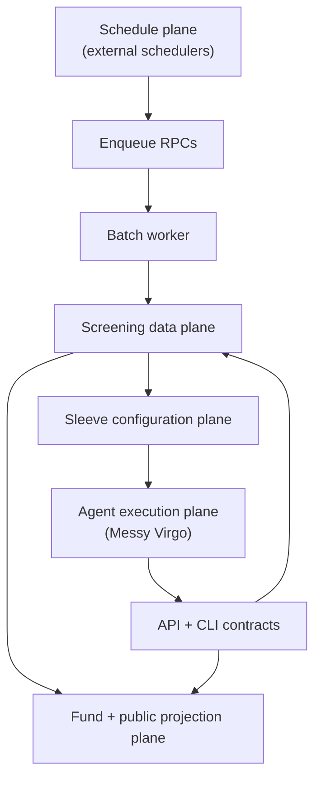

In [part 1](./2026-04-15-messy-virgo-screening-from-catalog-to-daily-substrate.md), we covered how Messy prepares screening: the monthly catalog, the weekly context refresh, saved strategy views, and the **shared daily signal layer**—so sleeve screening can be fast and easy to compare across runs.

This post covers the downstream half: how a **fund sleeve** turns that foundation into a **persisted screening outcome**, why **configuration is not execution**, and how Messy Virgo behaves as an **operator** over stable platform workflows—not a parallel source of truth.

> **Note:** This is a snapshot of the screening direction, not a frozen spec. Interfaces may evolve; the boundaries described here should remain the guardrails.

---

## The mental model: screening is a coordinated system

Screening is easy to narrate poorly (“the agent screens tokens”). The implemented system is stronger: it is a set of planes with different responsibilities.

At a high level:

1. **Schedule plane** — triggers upstream batch work (cadence only)
2. **Screening data plane** — authoritative screening state (inventory, universes, runs, indicators, saved runs)
3. **Sleeve configuration plane** — sleeve-specific intent (templates, queries, workflow, instructions)
4. **Agent execution plane** — operator-facing orchestration (validate, run, persist)
5. **Fund projection plane** — fund activities and published reads derived from saved runs

**What to notice:**

- **Freshness** is created upstream; **truth** lives in the data plane; **intent** lives in sleeve configuration; **saved outcomes** are created through explicit persistence contracts.
- Public and fund-facing surfaces are intentionally **downstream of saved runs**, not reconstructed ad hoc from raw indicator tables at read time.

---

## Stage 5: sleeve screening configuration — “what is this sleeve trying to do?”

Each sleeve stores its own screening context:

- reusable **custom queries**
- an ordered **workflow** of template and query steps
- freeform **instructions** for orchestration and review norms

This is where human and agent intent lives—but with a critical boundary:

**Saving sleeve context changes future behavior. It does not, by itself, create a persisted screening run.**

That single rule is what keeps automation inspectable. Without it, “the assistant updated something” collapses into “did we just screen?” and audit trails become arguments.

---

## Stage 6: sleeve screening execution — “what did we decide today, on the record?”

Execution is where a user or Messy Virgo performs sleeve screening end-to-end:

1. load the sleeve screening context
2. resolve each workflow step into a concrete screen request
3. verify the relevant **daily snapshot** is ready for the intended universe run
4. run one or more screening queries against the sleeve’s universe over the prepared indicator substrate
5. interpret returned evidence into shortlist candidates with reasons
6. persist **one sleeve/day** screening run

The persisted result is the fund-facing artifact: it can be loaded via fund-scoped APIs, appears in **fund activities**, and can be surfaced on **published fund reads** where appropriate.

This is also the boundary where screening stops being “internal prep” and becomes **visible product**: shortlists, narratives, and traceable execution summaries.

---

## The three time concepts (why history stays honest)

Messy screening uses three different time concepts on purpose:

- **`snapshot_date`**: the **due diligence indicator date** used by a screen (what substrate you screened against)
- **`run_date`**: the **UTC business day key** for the saved sleeve screening run (stable same-day replacement semantics)
- **`screened_at`**: when the saved sleeve screening run was **persisted**

They are often close, but they are not interchangeable.

**Why that matters:**

- a saved screening run needs a stable **same-day replacement key** (`run_date`)
- the DD snapshot must describe the **actual indicator substrate** used (`snapshot_date`)
- the persistence timestamp should still communicate **when the record was written** (`screened_at`)

Without this separation, “what did we know then?” becomes unanswerable—especially across retries, partial upstream coverage, and agent-driven reruns.

---

## Configuration vs execution: the non-negotiable boundary

The most important downstream rule is blunt:

**Configuration is not execution.**

Concretely:

- editing sleeve screening context updates **future** runs
- validating a query against indicators can be useful—and still **not** a saved run
- only the **screen run persistence contract** creates or replaces the durable sleeve/day outcome

This boundary is enforced consistently across API, CLI, and agent skills so that “help me explore” cannot silently become “we officially screened.”

---

## Messy Virgo: assistant as operator, not alternate database

The screening pipeline is one of the clearest places where Messy Virgo already behaves like an **operating assistant** rather than a generic chat layer.

The assistant exposes two disciplined capabilities aligned to the boundary above:

- **`mv-screening-configuration`** — edit sleeve screening context safely
- **`mv-screening-execution`** — validate readiness, run workflows, persist sleeve/day results

Those skills do not invent a parallel screening universe. They are **interfaces over the same contracts** humans use: stable inputs, stable outputs, stable persistence.

**What the agent should do well:** orchestrate steps, recover from common mistakes, explain outcomes with references to persisted traces.

**What the agent must not do:** invent screening truth outside persisted records, treat validation as publication, or bypass invariants that exist to protect fund integrity.

---

## Fund projection: activities vs the full run

Downstream fund surfaces intentionally separate **navigation** from **payload**:

- the **activity feed** stays lightweight: a timeline entry that points to a screening event
- the **saved screen run** remains the canonical place for full detail: execution trace, catalog context, candidate reasoning, and counters that make partial coverage legible

Public and published reads follow the same architectural instinct: **stable projections** of durable artifacts, not best-effort recompute views that change when someone refactors a query.

---

## Readiness vs coverage (a subtle but important distinction)

A sleeve snapshot can be considered **ready** when the relevant universe run has completed for the intended date.

That does **not** guarantee every current universe member has a complete indicator row. The system allows **partial DD coverage** and exposes it through run metadata rather than hiding it.

That design choice matches messy markets: the goal is **decision-grade honesty**, not theatrical certainty.

---

## Reliability by design: what “safe automation” requires

Downstream screening reliability is less about “never fails” and more about **predictable failure modes**:

- if a universe run is not complete, screening should **refuse** ambiguous persistence rather than silently guessing
- if upstream indicators are partial, downstream should **surface** coverage so agents and humans argue with the evidence, not with missing zeros

This is the same platform instinct as graceful degradation in lenses: ship value, but do not lie.

---

## Security posture (high level)

Screening touches fund configuration and persisted outcomes, so the security story is about **contracts and access**, not clever prompts:

- fund-scoped reads and writes go through **authenticated APIs** with explicit authorization decisions
- the assistant operates through those surfaces rather than around them
- we avoid publishing low-level internals that would materially simplify exploitation (exact internal tables, privileged toggles, operational runbooks)

Transparency about architecture should not become a blueprint for breaking it.

---

## Testing philosophy (downstream)

Downstream screening tests focus on invariants that can break independently of UI polish:

- **configuration vs execution** behavior (no accidental persistence)
- **snapshot readiness** rules and error mapping
- **persistence atomicity** semantics for “replace candidates for this sleeve/day” style operations
- **projection reads** that must remain stable given a stored run

The goal is confidence that fund records remain **coherent** as the product surface expands.

---

## Roadmap context

Screening is part of Messy’s **Research** trajectory: structured workflows, inspectable automation, and durable artifacts that later decision systems can trust.

It is explicitly **not** the final word on portfolio construction, council decisions, trade generation, custody, or broker integration—those belong to adjacent or later systems. Screening ends when a sleeve/day result is **persisted and surfaced** as part of the fund record.

---

## How this connects back to part 1

The clean end-to-end story is:

- Messy prepares the token market through **scheduled upstream jobs**
- each sleeve stores its own screening **playbook**
- Messy Virgo can **configure** or **execute** that playbook through public contracts
- saved screening results become part of the fund’s **operating record**
- published fund surfaces can show those results **safely**

That is a stronger story than “a worker does DD somewhere and the UI sometimes reflects it”—and it is the story the architecture is built to support.

**Previous in this series:** [Messy Virgo screening, part 1: how we prepare the market before a fund screens](./2026-04-15-messy-virgo-screening-from-catalog-to-daily-substrate.md).

---

## Further reading (repository docs)

For implementers and contributors:

- `docs/concepts/screening-pipeline/screening-pipeline.md`
- `docs/concepts/screening-pipeline/messy-virgo-screening-architecture.md`
- `docs/concepts/screening-pipeline/technical/screening-runtime-contracts.md`
- `docs/concepts/screening-pipeline/technical/screening-runtime-data-and-public-projection.md`

If you are building agent-native fund workflows and want to collaborate or integrate, we would love to talk.
