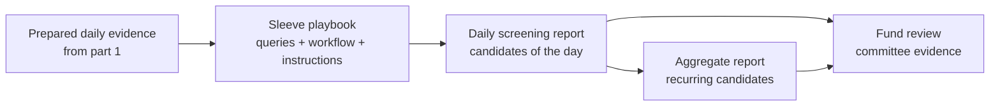

In [part 1](/blog/2026/04/messy-virgo-screening-part-1-how-we-prepare-the-market-before-a-fund-screens/), we covered how Messy prepares the market before a fund sleeve screens: the managed token catalog, the weekly screening context, reusable strategy views, and the shared daily due diligence layer.

That upstream work answers:

**What evidence is ready for this slice of the market today?**

This post covers what happens next.

Once the daily evidence layer exists, the sleeve still needs to turn it into something a fund team can review. That is the job of the **daily screening run**.

The daily screening run is the screener's daily report: **these are the candidates of the day, under this sleeve's playbook, with these reasons and caveats.**

Then, on top of those daily reports, Messy builds an **aggregate screening run**. The aggregate is closer to an executive report for a fund committee: it looks back across several daily reports and asks which names keep showing up.

That distinction matters. A daily candidate is interesting. A candidate that keeps returning across recent daily runs is a stronger screening signal.

> **Note:** This reflects where the screening system is headed and how we think about the product boundary. Details may change; the split between prepared evidence, daily candidate reports, and historical aggregation should stay the same.

---

## The missing middle: daily sleeve screening

Part 1 stopped before the sleeve made its own call. Messy had prepared a fresh evidence layer, but it had not yet produced a fund-facing shortlist.

That middle step is important enough to name clearly.

A **daily sleeve screening run** is where a specific sleeve asks:

**Given today's prepared evidence, which candidates should this strategy review now?**

It is not the same thing as the upstream daily due diligence work.

- Upstream daily work prepares evidence for a strategy view.
- Daily sleeve screening interprets that evidence for one sleeve.

The first is shared infrastructure. The second is fund workflow.

If the upstream layer is the evidence table, the daily sleeve run is the analyst note written from that table.

---

## What a daily run produces

A daily screening run should not feel like a disposable query result. It is a saved report for one sleeve on one day.

In plain terms, it yields:

- **Candidates of the day** - the short list the sleeve should review now
- **Candidate reasons** - why each token made the list
- **Process narrative** - how the screen was run and what mattered
- **Coverage context** - whether evidence was complete, partial, or uneven
- **Snapshot context** - which prepared daily evidence the sleeve used
- **Fund trace** - an activity or saved artifact that fund surfaces can point to

That saved report is the fund-facing artifact.

It says: for this sleeve, on this day, using this playbook, these were the candidates worth putting in front of the team.

That is different from "the agent found some tokens" or "a query returned some rows." The daily run is structured enough to review, compare, rerun, and publish safely.

---

## Why the daily report matters

Crypto changes quickly, so a daily report is allowed to be specific to the moment.

That is the point.

The daily run captures today's candidate set under today's evidence. It is useful because it is fresh, explicit, and traceable.

But a daily report also has a weakness: it is a snapshot.

One strong day can overstate a token. One weak data point can hide a good candidate. A sleeve might see momentum, liquidity, social attention, or risk context shift sharply from one run to the next.

So Messy does not stop at the daily report. It saves the daily report first, because that is the raw operating record. Then it can ask a second question:

**Which candidates survived the noise?**

That second question is what aggregation is for.

---

## Aggregate run: the committee view

An aggregate screening run looks back across recent daily screening runs for the **same sleeve**.

It asks:

**Which candidates keep appearing across the recent daily reports?**

That turns a set of snapshots into a more stable screening signal.

The aggregate does not replace the daily run. It sits above it:

- the **daily run** is the screener's daily report
- the **aggregate run** is the executive report built from recent daily reports

This matters for a fund committee because the aggregate gives the discussion a better starting point. Instead of asking only "what looked good today?," the committee can ask "what has kept showing up, and why?"

That does not make the aggregate a buy list. Screening still prepares evidence. It does not make the portfolio decision.

But the aggregate can make candidates stronger. A token that appears once may deserve a note. A token that appears repeatedly across the last several reports deserves a closer look.

---

## How the two reports line up

**What to take away:**

- Prepared daily evidence is the input, not the final sleeve report.
- The daily screening run creates the candidates of the day.
- The aggregate run reviews recent daily reports and highlights repeated candidates.
- The fund team can inspect both: the fresh daily snapshot and the smoother executive view.

---

## The playbook is intentionally configurable

Different sleeves should not be forced through the same screen.

Each sleeve can carry its own playbook:

- **Library queries** - shared screening patterns that can be reused across sleeves
- **Custom queries** - sleeve-specific screens for a particular strategy or mandate
- **Workflow order** - a saved sequence of template and custom steps
- **Instructions** - human-readable guidance for how an operator or assistant should interpret the results
- **Aggregation rules** - settings for how recent daily reports should be summarized

That configurability matters because a high-conviction sleeve, a broad discovery sleeve, and a liquidity-first sleeve are trying to answer different questions.

The guardrail is simple:

**Changing the playbook changes future behavior. It does not, by itself, create a saved daily report.**

That keeps exploration separate from the fund record. A manager or assistant can tune a workflow, validate a screen, or adjust aggregation instructions without accidentally publishing today's screening result.

---

## A concrete example

Imagine a sleeve focused on liquid Base ecosystem tokens.

Its playbook might say:

- start with a library query for liquidity and market quality
- add a custom query that favors recent momentum without allowing obvious risk flags
- keep a short workflow so the assistant can run the same steps repeatedly
- explain candidates in terms of liquidity, momentum, and risk hygiene
- aggregate the last week of daily reports so repeated names are easy to spot

On Monday, the daily report might surface a token because it has strong momentum and acceptable risk context.

On Tuesday, the same token might appear again, but with a different reason: liquidity improved, while momentum stayed intact.

On Friday, the aggregate report might show that the token appeared four times that week, while another appeared only once.

That does not automatically make the first token an allocation. It does make the evidence cleaner. The committee can see not only that the token screened well, but that it kept screening well.

---

## Why this is useful for agents

An assistant is useful in fund operations only when it works through clear records.

Messy Virgo can help configure the sleeve playbook, run the daily screening report, explain the candidates, and build the aggregate report. But it should not invent a separate source of truth.

The assistant is operating the same screening system a person would use:

- saved playbooks define intent
- daily reports create current candidate evidence
- aggregate reports summarize repeated candidate evidence
- fund surfaces read saved artifacts

That makes automation inspectable. If the result looks wrong, a team can ask concrete questions:

- Was the playbook too broad?
- Was today's evidence incomplete?
- Did one token appear once, or has it shown up all week?
- Did the aggregation window smooth the signal or hide a recent change?

Those are operational questions a fund team can reason about. They are much better than "what did the chat decide?"

---

## When coverage is imperfect

Crypto data is never perfectly clean. Some daily evidence will be partial. Some aggregate windows will be sparse. A sleeve's playbook may change during the period an aggregate is summarizing.

Messy is designed to keep those realities visible instead of pretending they do not exist.

For daily reports, the system distinguishes readiness from complete coverage: a screen can be ready to run even if some candidate evidence is partial, as long as the report makes that visible.

For aggregate reports, sparse windows can still be useful. If only a few daily runs exist, the aggregate can still be saved, but the source depth should be visible. If the playbook changed during the window, the aggregate should preserve that context instead of quietly mixing everything into one unexplained score.

The goal is decision-grade honesty, not theatrical certainty.

---

## What this adds to the fund record

The fund record now has two complementary screening artifacts:

- **Daily screening reports** for current sleeve review
- **Aggregate screening reports** for recurring candidate signal

That means a fund surface can show not only "what did we screen today?" but also "which candidates have kept showing up recently?"

For fund teams, that makes review easier. For public readers, it makes screening less mysterious. For future decision systems, it creates better evidence lineage.

---

## How we think about quality

The key quality questions are not cosmetic:

- Does configuration stay separate from execution?
- Does a daily report point to the evidence it actually used?
- Does the daily report explain why each candidate made the list?
- Does the aggregate report summarize the same sleeve's recent history?
- Are sparse or mixed windows visible?
- Can a person or assistant rerun the workflow without rewriting history by accident?

Those are the invariants that make screening dependable enough to build on.

---

## Where this sits on the roadmap

Part 1 explained how Messy prepares the market before a sleeve screens. Part 2 explains how sleeves turn that preparation into daily candidate reports, then aggregate those reports into stronger committee-ready evidence.

That still stops short of portfolio construction. Screening is not a trade generator, a council vote, or a custody system. It is the research pipeline that makes those later decisions more inspectable.

The near-term direction is straightforward: make the daily report useful, make the aggregate report stronger, and keep Messy Virgo operating through the same durable workflows that humans can inspect.

**Previous in this series:** [Messy Virgo screening, part 1: how we prepare the market before a fund screens](/blog/2026/04/messy-virgo-screening-part-1-how-we-prepare-the-market-before-a-fund-screens/).
