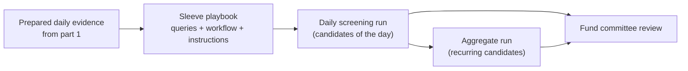

In [part 1](/blog/2026/04/messy-virgo-screening-part-1-how-we-prepare-the-market-before-a-fund-screens/), we covered how Messy prepares the market before a fund sleeve screens: the managed token catalog, the weekly screening context, reusable strategy views, and the shared daily due diligence layer.

That upstream work produces fresh evidence each day. This post describes what happens next: the daily screening run that interprets the evidence for a specific sleeve, the aggregate run that identifies persistent signals across days, and the configurable playbooks that define each sleeve's process.

> **Note:** This reflects where the screening system is headed. Details may change, but the separation between prepared evidence, daily candidate reports, and historical aggregation should remain.

---

## Daily screening runs

A **daily screening run** applies a sleeve's playbook to that day's prepared evidence and produces a saved report.

It answers: given today's evidence and this sleeve's rules, which candidates should the team review now?

The report contains:

- **Candidates of the day** — the shortlist to review
- **Reasons** — why each token qualified under the current playbook
- **Process narrative** — how the screen was executed
- **Coverage context** — completeness of the underlying evidence
- **Evidence snapshot** — reference to the exact prepared data used
- **Fund trace** — a durable artifact that other fund surfaces can reference

This report is the primary, reviewable record for the sleeve on that day.

---

## Aggregate screening runs

Daily reports capture snapshots. To surface what persists through market noise, Messy builds **aggregate screening runs**.

An aggregate examines the most recent daily screening runs for the *same sleeve* and highlights candidates that keep appearing. It provides a steadier signal for committee discussions.

The two layers work together:

- The daily run is the screener's report for today
- The aggregate run is the committee view built from recent dailies

Fund interfaces can show both the fresh daily list and the recurring candidates side by side.

---

## Configurable playbooks

Every sleeve uses its own playbook. This lets different strategies screen differently without forcing a single rigid process.

A playbook includes:

- Library queries — reusable screening patterns available to all sleeves
- Custom queries — sleeve-specific logic for its mandate
- Workflow order — the saved sequence of steps
- Interpretation instructions — guidance for operators or assistants reading the output
- Aggregation rules — how recent daily runs should be summarized into the aggregate view

Playbooks are edited independently. Changing one updates future behavior but does not create, modify, or delete existing daily or aggregate reports. This keeps experimentation separate from the official fund record.

---

## Example: Liquid Base sleeve

A sleeve focused on liquid tokens on Base might configure its playbook like this:

- Begin with a library query for liquidity and market quality
- Layer a custom query for recent momentum while guarding against clear risk flags
- Use a compact, repeatable workflow
- Instruct the assistant to explain candidates in terms of liquidity, momentum, and risk hygiene
- Aggregate the last seven daily runs to highlight consistency

Throughout the week the same token might surface with evolving reasons (strong momentum Monday, improved liquidity Wednesday). The Friday aggregate would then show it appeared four times while others appeared only once. The committee sees both the daily snapshots and the pattern of persistence.

---

## Imperfect coverage stays visible

Crypto data is rarely complete. Some evidence will always be partial, some aggregation windows sparse, and playbooks may evolve mid-period.

The system is built to make these realities explicit rather than hidden:

- Daily reports flag partial evidence
- Aggregate reports preserve context about data depth and playbook changes during the window

Gaps remain part of the record, supporting more honest decisions.

---

## On the roadmap

Part 1 described market preparation. This post completes the screening side: from prepared evidence through daily runs and aggregates to committee-ready artifacts. The pipeline stops short of portfolio construction, custody, or execution—those come later.

The near-term focus is making daily reports immediately useful, strengthening the aggregates, and ensuring every step remains inspectable by both humans and assistants.

**Previous in this series:** [Messy Virgo screening, part 1: how we prepare the market before a fund screens](/blog/2026/04/messy-virgo-screening-part-1-how-we-prepare-the-market-before-a-fund-screens/).
